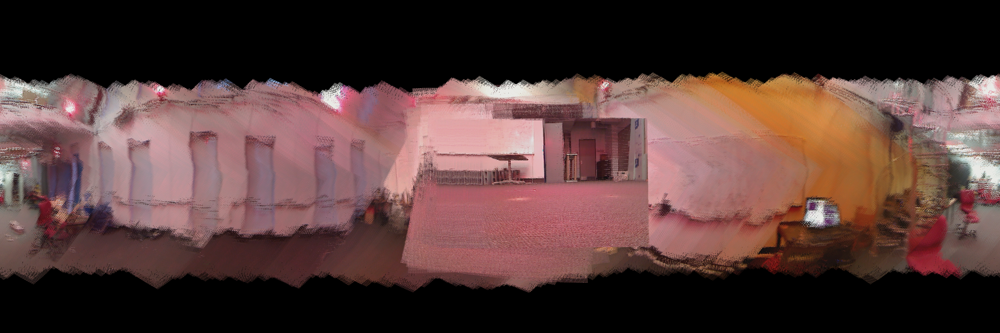

# imu_PGD_calibration
An imu calibration task based on projected gradient descent(PGD)

## Installation
```
conda create -n imu_tracking python=3.8
conda activate imu_tracking
pip install -r requirements.txt
```

## Usage
1. Download the trainset and the testset following the README.md whithin the "data" folder. You should put the datasets under the "data" folder.
2. Modify `dataset=""` in *trainset.py* and *testset.py* to decide which dataset you would like to use.
3. Run `python trainset.py` to get the comparison between the estimated rotation and the GT. You'll also get "cylinder_image_imu.png" and "cylinder_image_vicon.png", representing the panoramas generated from estimation and GT respectively.
4. Run `python testset.py` to get the estimated rotation of the testset. You'll also get "cylinder_image_test.png" as the generated panorama.
5. We also provide *trainset.ipynb* and *testset.ipynb* for seperate code blocks.

## Example

